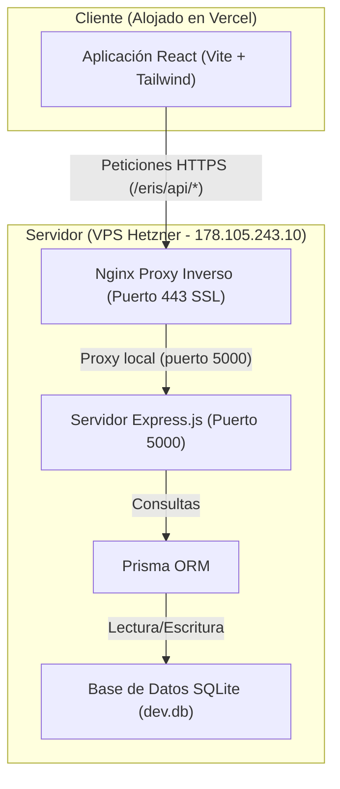
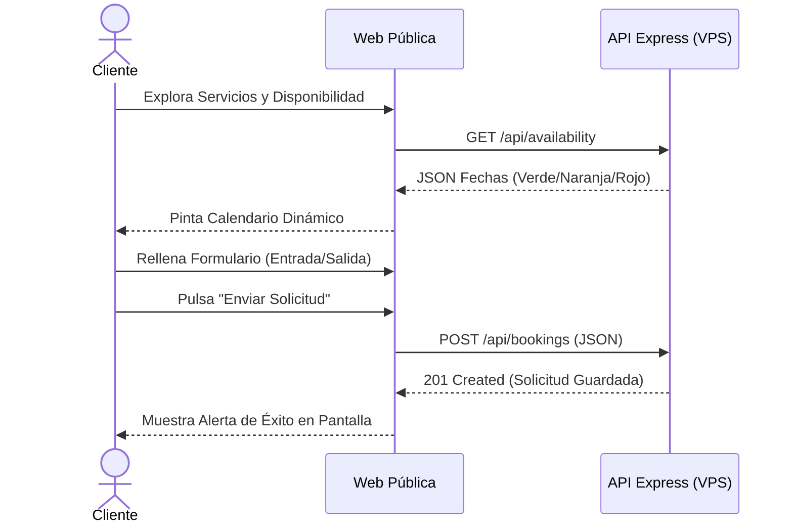
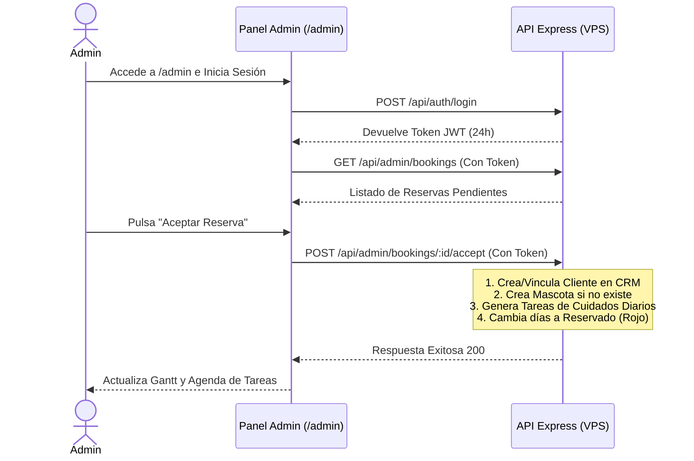
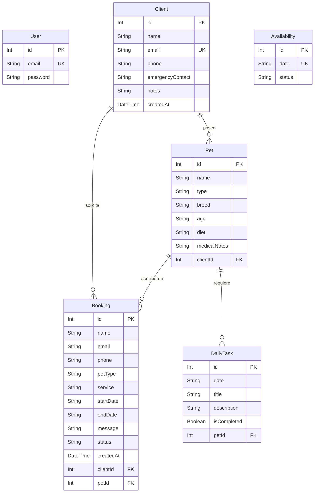

# Documentación de Arquitectura, UX y Funcionalidades: Eris Pet Care

Este documento describe de manera exhaustiva el diseño de experiencia de usuario (UX), las funcionalidades del sistema, la arquitectura técnica fullstack y el modelo de datos de la plataforma **Eris Pet Care**.

---

## 1. Arquitectura del Sistema

La plataforma sigue una arquitectura cliente-servidor híbrida desacoplada, optimizada para un despliegue ágil, seguro y gratuito para el cliente web.

### Detalle de Componentes
1. **Frontend (React + Vite)**: Alojado en **Vercel** (`https://guarder-a-animales.vercel.app/`). Compila la SPA estática que consume las APIs.
2. **Servidor Web (Nginx)**: Actúa como proxy inverso en la VPS de Hetzner. Recibe tráfico seguro en `https://alilyback.duckdns.org/eris/api/` y redirige internamente al puerto local `5000` de Express, abstrayendo el prefijo `/eris/` y resolviendo la validación SSL con Let's Encrypt de forma unificada.
3. **Backend (Express + Node.js)**: Servidor de API REST encargado de la autenticación JWT, las reglas de negocio, la lógica de calendarización y la orquestación del CRM.
4. **Base de Datos (SQLite + Prisma ORM)**: Una base de datos relacional ligera y autocontenida en `/server/prisma/dev.db` que simplifica los respaldos y reduce la latencia en consultas concurrentes de bajo/medio volumen.

---

## 2. Experiencia de Usuario (UX) y Flujos de Trabajo

### Flujo del Cliente (Público)

1. **Exploración**: El usuario visita la landing page, revisa el portafolio de mascotas de la casa, los servicios y el calendario de disponibilidad real (Julio 2026).
2. **Solicitud Estructurada**: El usuario selecciona una fecha de entrada y salida a través de calendarios nativos interactivos (impidiendo fechas inválidas o de texto libre).
3. **Confirmación Visual**: La web muestra un spinner de carga dinámico y, al recibir respuesta del servidor, despliega un banner de éxito verde con instrucciones de seguimiento, limpiando el formulario automáticamente.

---

### Flujo del Administrador (Backoffice Privado)

1. **Acceso Seguro**: El administrador accede mediante la ruta limpia `/admin`. Si no hay token de autenticación válido en `localStorage`, se dibuja una interfaz de Login con diseño minimalista y centrado.
2. **Aceptación Inteligente**: Al recibir una reserva pendiente, el administrador puede:
   * **Rechazar**: Cambia el estado a rechazado.
   * **Aceptar**: El sistema ejecuta un proceso por lotes transaccional en el backend que automatiza todo el CRM del sitter (crea el cliente si el email es nuevo, asocia la mascota, bloquea las fechas en el calendario público marcándolas en rojo, y pre-genera la agenda de comidas y paseos diarios).
3. **Planificador Visual (Gantt)**: El administrador monitoriza la ocupación de la casa a través de un cronograma interactivo de cuadrícula de 31 días. Cada mascota aceptada tiene su fila con una barra de color terracota que delimita visualmente su estancia.
4. **Operaciones Diarias (Checklist)**: El administrador tiene una agenda dinámica. Al seleccionar cualquier fecha, el sistema detecta qué mascotas están en la casa ese día y despliega una lista de verificación (comida, paseos, medicación especial). El administrador puede marcar tareas como completadas o añadir tareas ad-hoc (ej. "Comprar champú especial").

---

## 3. Modelo de Datos (Esquema de Base de Datos)

El esquema de base de datos relacional está optimizado para integridad referencial utilizando eliminaciones en cascada para registros dependientes (por ejemplo, si se elimina una mascota, sus tareas diarias asociadas se eliminan automáticamente).

### Detalle de las Tablas

* **User**: Credenciales del administrador. La contraseña se almacena encriptada utilizando un hash de una sola vía (Bcrypt con 10 rondas de sal).
* **Client**: Directorio de propietarios permanentes del CRM. El email es único.
* **Pet**: Base de datos de animales. Se conecta directamente a un cliente (`clientId`) mediante una clave foránea que activa la eliminación en cascada.
* **Booking**: Registra el flujo de reservas web. Inicialmente se almacena con datos crudos y estado `PENDIENTE`. Al ser aceptada, se enlazan las claves foráneas de `clientId` y `petId` resultantes del procesamiento inteligente.
* **DailyTask**: Tareas operativas diarias de cuidado de mascotas. Relacionada opcionalmente a un `petId`.
* **Availability**: Fechas del calendario público (`YYYY-MM-DD`) que anulan los cálculos por defecto y fuerzan un estado visual (`bg-green-500` - Libre, `bg-red-400` - Reservado, `bg-orange-300` - Consultar).

---

## 4. Endpoints de la API REST

Todos los endpoints privados requieren una cabecera de autenticación `Authorization: Bearer <JWT_TOKEN>`. Si el token no está presente o ha expirado (validez de 24 horas), el servidor responderá con `401 Unauthorized`.

| Método | Endpoint | Acceso | Descripción |
| :--- | :--- | :--- | :--- |
| **POST** | `/api/auth/login` | Público | Autentica al administrador y devuelve el token JWT de sesión. |
| **GET** | `/api/availability` | Público | Devuelve el listado de fechas modificadas y su estado. |
| **POST** | `/api/bookings` | Público | Registra una nueva solicitud de reserva desde el formulario de contacto público. |
| **GET** | `/api/admin/bookings` | Privado (JWT) | Lista todas las reservas del sistema (orden descendente de fecha). |
| **POST** | `/api/admin/bookings/:id/accept` | Privado (JWT) | Acepta la reserva, crea/vincula fichas en CRM y genera las tareas de cuidado. |
| **PATCH** | `/api/admin/bookings/:id/reject` | Privado (JWT) | Marca el estado de una reserva como `RECHAZADA`. |
| **PATCH** | `/api/admin/bookings/:id/reopen` | Privado (JWT) | Devuelve una reserva al estado `PENDIENTE` para volver a procesarla. |
| **GET** | `/api/admin/clients` | Privado (JWT) | Obtiene todos los clientes del CRM incluyendo sus mascotas asociadas. |
| **POST** | `/api/admin/clients` | Privado (JWT) | Registra un cliente de forma manual en el CRM. |
| **PATCH** | `/api/admin/clients/:id` | Privado (JWT) | Modifica los datos de un cliente del CRM. |
| **DELETE** | `/api/admin/clients/:id` | Privado (JWT) | Elimina a un cliente y sus mascotas (en cascada) de la base de datos. |
| **GET** | `/api/admin/pets` | Privado (JWT) | Obtiene todas las mascotas registradas con los datos de sus dueños. |
| **POST** | `/api/admin/pets` | Privado (JWT) | Crea una mascota de forma manual y la asocia a un cliente. |
| **PATCH** | `/api/admin/pets/:id` | Privado (JWT) | Modifica la ficha clínica, dieta o datos de una mascota. |
| **DELETE** | `/api/admin/pets/:id` | Privado (JWT) | Elimina la ficha de una mascota del CRM de forma permanente. |
| **GET** | `/api/admin/tasks` | Privado (JWT) | Devuelve las tareas y las mascotas hospedadas activas para la fecha especificada (`?date=YYYY-MM-DD`). |
| **POST** | `/api/admin/tasks` | Privado (JWT) | Añade una tarea personalizada (asociada o no a una mascota hospedada). |
| **PATCH** | `/api/admin/tasks/:id` | Privado (JWT) | Alterna el estado `isCompleted` de una tarea diaria (completada/pendiente). |
| **DELETE** | `/api/admin/tasks/:id` | Privado (JWT) | Elimina una tarea diaria de la agenda de cuidados. |
| **POST** | `/api/admin/availability` | Privado (JWT) | Crea o actualiza el estado de disponibilidad del calendario para una fecha específica. |

---

## 5. Diseño Visual y UX del Frontend

El frontend implementa una interfaz moderna con las siguientes directrices de diseño:
* **Paleta Armónica**: Uso de tonos terrosos y cálidos alineados con el cuidado de mascotas (Terracota `#C27A65`, Fondo `#fcf9f4`, Superficies `#f6f3ee`, y Primario `#894b39`).
* **Glassmorphism**: El panel de login y las tarjetas de control del administrador utilizan fondos semi-translúcidos con desenfoque de fondo (`backdrop-filter`) y sombras sutiles que aportan profundidad.
* **Componentes Responsivos**: 
  * Formularios que se apilan automáticamente en móvil y se expanden a dos columnas en pantallas de escritorio.
  * El planificador de ocupación implementa un contenedor con scroll horizontal (`overflow-x-auto`) que permite una visualización perfecta de la cuadrícula de 31 días en pantallas pequeñas sin romper la estructura.
* **Indicadores Dinámicos**: Los estados de las reservas se identifican rápidamente mediante badges de color (Naranja = Pendiente, Verde = Aceptado, Rojo = Rechazado), agilizando el flujo de trabajo diario del cuidador.
